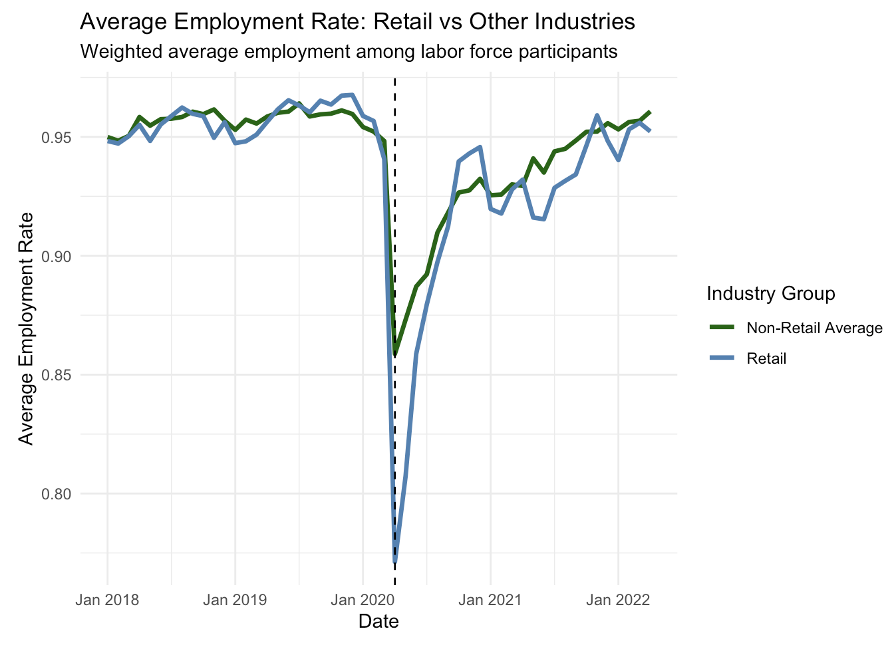

## 🟦 Project Background

The COVID-19 pandemic introduced an unprecedented disruption to the U.S. labor market, with the retail sector experiencing some of the most immediate and visible impacts. Despite the availability of large-scale employment data, understanding how workforce dynamics shifted—both in terms of employment levels and labor utilization—remains challenging without structured analysis.

This project analyzes **IPUMS CPS (Current Population Survey)** microdata to evaluate how retail employment and average weekly hours worked changed before and after the onset of COVID-19 in March 2020. The dataset spans multiple years of monthly labor force data, enabling a detailed view of workforce trends at a national level.

Without structured analysis, it is difficult to answer critical questions such as:
- How severely was retail employment impacted at the onset of COVID-19?
- Did reduced employment come with changes in labor intensity (hours worked)?
- Was the disruption temporary, or did it create a structural shift in retail labor dynamics?
- How does retail compare to broader labor market trends during the same period?

#### **Overall Goal: Quantify the immediate and structural impact of COVID-19 on retail employment and labor utilization to better understand workforce resilience and recovery patterns.**

This project transforms raw CPS microdata into actionable insights using **R for data processing, statistical modeling, and visualization**.

- Visualizations highlight **when and how labor trends changed**
- Statistical modeling explains **the magnitude and significance of those changes**

Together, they provide both **descriptive and causal insight**, moving beyond surface-level trends into measurable impact.

> **Note:** Full methodology, regression outputs, and extended analysis are available in the final submission.

Targeted analysis and full results can be found [here](https://github.com/a-paija/Covid-19-Retail-Employment/blob/main/Data%20Translation%20Submission.html)

## 🟦 Data Structure & Initial Checks

Each observation represents an individual respondent, including:
- Industry classification (used to isolate retail sectors)
- Employment status
- Weekly hours worked
- Survey weights for population-level aggregation

Retail industries were filtered using standardized CPS industry codes (motor vehicles, grocery, clothing, furniture, etc.), and survey weights were applied to ensure nationally representative estimates.

## 🟦 Data Cleaning & Preparation (R)

Steps included:
- Filtering for retail industry observations only
- Creating pre- and post-COVID indicators centered on March 2020
- Constructing weighted employment measures using CPS sampling weights
- Standardizing time variables for monthly time-series analysis

These steps ensured the dataset could support both trend analysis and causal inference techniques.

## 🟩 Executive Summary

Retail employment experienced a sharp structural disruption at the onset of COVID-19, with both employment levels and average weekly hours showing immediate and significant changes.

Key patterns:
- Sudden drop and volatility in employment levels around March 2020
- Decline in average weekly hours, indicating reduced labor utilization
- Evidence of a structural break in labor dynamics rather than a temporary fluctuation

> **Core Insight:** COVID-19 did not just disrupt retail employment temporarily—it fundamentally altered workforce structure and labor utilization patterns.

## 🟨 Employment Trends & Labor Market Shock

Time-series analysis shows a clear discontinuity in retail employment levels at the onset of the pandemic.

- Sharp decline in March 2020 followed by instability in subsequent months
- Magnitude exceeds normal monthly variation
- Recovery is uneven and incomplete

**Business Insight:** Retail employment is highly sensitive to external shocks, requiring stronger risk-aware workforce planning.

## 🟨 Labor Utilization & Weekly Hours

Average weekly hours provide insight into labor intensity beyond headcount.

- Weekly hours declined post-COVID
- Indicates reduced scheduling and demand contraction
- Adjustments occurred in both employment and hours

**Business Insight:** Firms responded by scaling down labor usage, not just employment.

## 🟧 Causal Impact Analysis (RDD)

A Regression Discontinuity Design (RDD) was applied around March 2020.

- Statistically significant structural break in employment and hours
- Confirms changes are pandemic-driven, not trend-based
- Validates a causal shift in retail labor dynamics

**Business Insight:** The shock was abrupt, requiring adaptive labor strategies.

## 🟨 Key Visualizations

